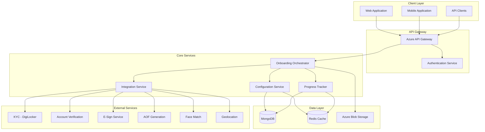
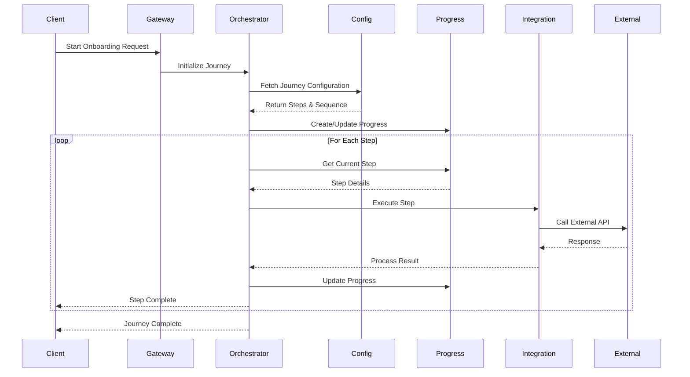
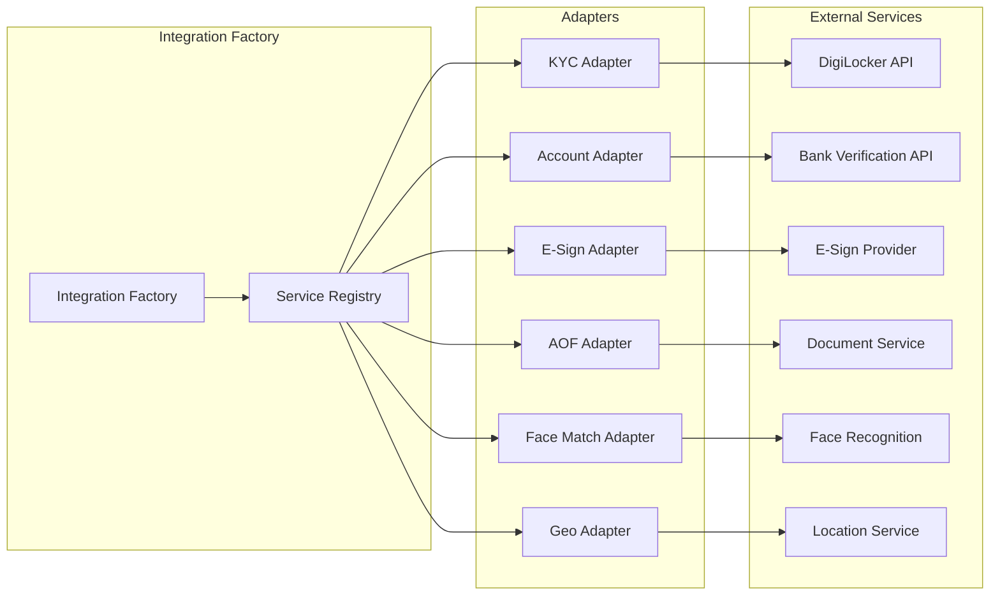

# User Onboarding Service - Technical Implementation Plan

## Index

1. [Executive Summary](#executive-summary)
2. [System Architecture Overview](#system-architecture-overview)
3. [Codebase Structure](#codebase-structure)
4. [API Routes and Definitions](#api-routes-and-definitions)
5. [Database Design and Schema](#database-design-and-schema)
6. [Third-Party Integration Layer](#third-party-integration-layer)
7. [Infrastructure and Deployment](#infrastructure-and-deployment)
8. [Configuration Management](#configuration-management)
9. [Setup and Environment](#setup-and-environment)
10. [Monitoring and Observability](#monitoring-and-observability)

---

## Summary

The User Onboarding Service is a centralized, configuration-driven platform designed to orchestrate multi-step onboarding journeys across various financial services including Mutual Funds, Broking, Insurance, and General services. The system leverages a microservices architecture with Node.js, MongoDB for persistence, and Redis for caching, deployed on Azure Cloud using containerization and Infrastructure as Code (IaC) principles.

### Key Features
- **Dynamic Journey Configuration**: Database-driven step sequences and validations
- **Resume Capability**: Pause and continue from any step in the journey
- **Multi-tenant Support**: Different configurations per service type
- **Extensible Integration Layer**: Pluggable third-party service integrations
- **Real-time Progress Tracking**: Step-wise updates and validation

---

## System Architecture Overview

### High-Level Architecture



### Service Communication Flow



---

## Codebase Structure

```
onboarding-service/
├── src/
│   ├── api/
│   │   ├── controllers/
│   │   │   ├── onboarding.controller.ts
│   │   │   ├── progress.controller.ts
│   │   │   ├── config.controller.ts
│   │   │   └── integration.controller.ts
│   │   ├── routes/
│   │   │   ├── onboarding.routes.ts
│   │   │   ├── progress.routes.ts
│   │   │   ├── config.routes.ts
│   │   │   └── integration.routes.ts
│   │   ├── middlewares/
│   │   │   ├── auth.middleware.ts
│   │   │   ├── validation.middleware.ts
│   │   │   ├── error.middleware.ts
│   │   │   └── rateLimit.middleware.ts
│   │   └── validators/
│   │       ├── onboarding.validator.ts
│   │       └── step.validator.ts
│   ├── services/
│   │   ├── orchestrator/
│   │   │   ├── orchestrator.service.ts
│   │   │   ├── stepExecutor.service.ts
│   │   │   └── flowEngine.service.ts
│   │   ├── configuration/
│   │   │   ├── config.service.ts
│   │   │   ├── journey.service.ts
│   │   │   └── step.service.ts
│   │   ├── progress/
│   │   │   ├── progress.service.ts
│   │   │   ├── resume.service.ts
│   │   │   └── tracking.service.ts
│   │   └── integration/
│   │       ├── integration.factory.ts
│   │       ├── adapters/
│   │       │   ├── digilocker.adapter.ts
│   │       │   ├── account.adapter.ts
│   │       │   ├── esign.adapter.ts
│   │       │   ├── aof.adapter.ts
│   │       │   ├── facematch.adapter.ts
│   │       │   └── geolocation.adapter.ts
│   │       └── interfaces/
│   │           └── integration.interface.ts
│   ├── models/
│   │   ├── onboarding.model.ts
│   │   ├── progress.model.ts
│   │   ├── configuration.model.ts
│   │   └── step.model.ts
│   ├── repositories/
│   │   ├── base.repository.ts
│   │   ├── onboarding.repository.ts
│   │   ├── progress.repository.ts
│   │   └── config.repository.ts
│   ├── utils/
│   │   ├── logger.ts
│   │   ├── cache.ts
│   │   ├── encryption.ts
│   │   └── constants.ts
│   ├── config/
│   │   ├── database.config.ts
│   │   ├── redis.config.ts
│   │   ├── app.config.ts
│   │   └── integration.config.ts
│   └── app.ts
├── tests/
│   ├── unit/
│   ├── integration/
│   └── e2e/
├── scripts/
│   ├── seed-data.ts
│   └── migrate.ts
├── docker/
│   ├── Dockerfile
│   └── docker-compose.yml
├── terraform/
│   ├── main.tf
│   ├── variables.tf
│   ├── outputs.tf
│   └── modules/
├── .env.example
├── package.json
├── tsconfig.json
└── README.md
```

---

## API Routes and Definitions

### Base URL Structure
```
https://api.onboarding.service/v1
```

### 1. Onboarding Journey APIs

#### Initialize Onboarding
```typescript
POST /onboarding/initialize
Headers: {
  "Authorization": "Bearer {token}",
  "X-Client-Id": "{clientId}",
  "X-Journey-Type": "{journeyType}"
}
Body: {
  "userId": "string",
  "journeyType": "MUTUAL_FUNDS | BROKING | INSURANCE | GENERAL",
  "metadata": {
    "source": "string",
    "referralCode": "string",
    "additionalInfo": "object"
  }
}
Response: {
  "journeyId": "string",
  "userId": "string",
  "journeyType": "string",
  "totalSteps": "number",
  "currentStep": "number",
  "steps": [
    {
      "stepId": "string",
      "stepKey": "string",
      "order": "number",
      "status": "PENDING | IN_PROGRESS | COMPLETED",
      "mandatory": "boolean"
    }
  ]
}
```

#### Get Current Journey Status
```typescript
GET /onboarding/journey/{journeyId}/status
Response: {
  "journeyId": "string",
  "status": "STARTED | IN_PROGRESS | COMPLETED | PAUSED | FAILED",
  "currentStep": {
    "stepId": "string",
    "stepKey": "string",
    "order": "number"
  },
  "completedSteps": ["string"],
  "remainingSteps": ["string"],
  "progressPercentage": "number"
}
```

#### Execute Step
```typescript
POST /onboarding/journey/{journeyId}/step/{stepId}/execute
Body: {
  "stepData": "object", // Dynamic based on step type
  "validationData": "object"
}
Response: {
  "success": "boolean",
  "stepResult": {
    "stepId": "string",
    "status": "COMPLETED | FAILED | PENDING_VALIDATION",
    "validationErrors": ["string"],
    "nextStep": "string | null"
  }
}
```

### 2. Progress Management APIs

#### Resume Journey
```typescript
POST /progress/resume
Body: {
  "userId": "string",
  "journeyId": "string"
}
Response: {
  "journeyId": "string",
  "resumedFromStep": {
    "stepId": "string",
    "stepKey": "string",
    "order": "number"
  },
  "journeyData": "object"
}
```

#### Save Progress
```typescript
PUT /progress/save
Body: {
  "journeyId": "string",
  "currentStep": "string",
  "completedSteps": ["string"],
  "partialData": "object"
}
```

#### Get User Progress
```typescript
GET /progress/user/{userId}
Response: {
  "activeJourneys": [
    {
      "journeyId": "string",
      "journeyType": "string",
      "status": "string",
      "lastUpdated": "datetime"
    }
  ],
  "completedJourneys": ["object"]
}
```

### 3. Configuration Management APIs

#### Get Journey Configuration
```typescript
GET /config/journey/{journeyType}
Response: {
  "journeyType": "string",
  "version": "string",
  "steps": [
    {
      "stepKey": "string",
      "order": "number",
      "config": {
        "validations": ["object"],
        "integrations": ["string"],
        "uiConfig": "object"
      }
    }
  ]
}
```

#### Update Journey Configuration (Admin)
```typescript
PUT /config/journey/{journeyType}
Headers: {
  "X-Admin-Token": "{adminToken}"
}
Body: {
  "version": "string",
  "steps": ["object"],
  "metadata": "object"
}
```

### 4. Integration APIs

#### Trigger KYC Verification
```typescript
POST /integration/kyc/verify
Body: {
  "journeyId": "string",
  "pan": "string",
  "aadhaar": "string",
  "consentToken": "string"
}
```

#### Account Verification
```typescript
POST /integration/account/verify
Body: {
  "journeyId": "string",
  "accountNumber": "string",
  "ifscCode": "string"
}
```

#### E-Sign Document
```typescript
POST /integration/esign/initiate
Body: {
  "journeyId": "string",
  "documentId": "string",
  "signatureCoordinates": "object"
}
```

#### Face Match Verification
```typescript
POST /integration/facematch/verify
Body: {
  "journeyId": "string",
  "selfieImage": "base64",
  "documentImage": "base64"
}
```

---

## Database Design and Schema

### MongoDB Collections

#### 1. onboarding_types Collection
```javascript
{
  "_id": ObjectId,
  "typeKey": "MUTUAL_FUNDS",
  "name": "Mutual Funds Onboarding",
  "description": "Onboarding flow for mutual fund investments",
  "configVersion": "1.2.0",
  "active": true,
  "licenseSet": "A",
  "metadata": {
    "minSteps": 5,
    "maxSteps": 8,
    "estimatedTime": "15 minutes",
    "requiredDocuments": ["PAN", "Aadhaar", "Bank Statement"]
  },
  "createdAt": ISODate,
  "updatedAt": ISODate
}
```

#### 2. journey_configurations Collection
```javascript
{
  "_id": ObjectId,
  "onboardingTypeId": ObjectId,
  "version": "1.2.0",
  "steps": [
    {
      "stepId": "uuid",
      "stepKey": "email_verification",
      "order": 1,
      "name": "Email Verification",
      "description": "Verify user email address",
      "mandatory": true,
      "config": {
        "validations": [
          {
            "type": "email",
            "rules": {
              "required": true,
              "format": "email",
              "domain": ["gmail.com", "yahoo.com"]
            }
          }
        ],
        "integrations": [],
        "timeout": 300,
        "retryLimit": 3,
        "uiConfig": {
          "component": "EmailVerificationForm",
          "props": {
            "showResend": true,
            "resendDelay": 60
          }
        }
      },
      "nextStep": {
        "default": "pan_kyc",
        "conditional": [
          {
            "condition": "previousKYC === true",
            "nextStepKey": "bank_verification"
          }
        ]
      }
    },
    {
      "stepId": "uuid",
      "stepKey": "pan_kyc",
      "order": 2,
      "name": "PAN & KYC Verification",
      "description": "Verify PAN and complete KYC",
      "mandatory": true,
      "config": {
        "validations": [
          {
            "type": "pan",
            "rules": {
              "required": true,
              "format": "^[A-Z]{5}[0-9]{4}[A-Z]{1}$"
            }
          }
        ],
        "integrations": ["DIGILOCKER", "CVLKRA"],
        "apiEndpoint": "/api/kyc/verify",
        "timeout": 600,
        "retryLimit": 2
      }
    }
  ],
  "metadata": {
    "flowType": "LINEAR",
    "allowSkip": false,
    "savePartialData": true
  },
  "createdAt": ISODate,
  "updatedAt": ISODate
}
```

#### 3. user_journeys Collection
```javascript
{
  "_id": ObjectId,
  "journeyId": "uuid",
  "userId": "string",
  "onboardingTypeId": ObjectId,
  "configVersion": "1.2.0",
  "status": "IN_PROGRESS", // STARTED, IN_PROGRESS, COMPLETED, PAUSED, FAILED
  "currentStepId": "uuid",
  "completedSteps": [
    {
      "stepId": "uuid",
      "completedAt": ISODate,
      "attempts": 1,
      "data": {}
    }
  ],
  "failedSteps": [
    {
      "stepId": "uuid",
      "failedAt": ISODate,
      "reason": "Validation failed",
      "errorDetails": {}
    }
  ],
  "metadata": {
    "source": "MOBILE_APP",
    "deviceInfo": {},
    "ipAddress": "string",
    "sessionId": "string"
  },
  "startedAt": ISODate,
  "lastUpdatedAt": ISODate,
  "completedAt": ISODate,
  "expiresAt": ISODate
}
```

#### 4. step_executions Collection
```javascript
{
  "_id": ObjectId,
  "journeyId": "uuid",
  "stepId": "uuid",
  "userId": "string",
  "executionId": "uuid",
  "status": "SUCCESS", // SUCCESS, FAILED, PENDING, TIMEOUT
  "input": {
    // Step-specific input data
  },
  "output": {
    // Step execution results
  },
  "integrationCalls": [
    {
      "service": "DIGILOCKER",
      "requestId": "string",
      "status": "SUCCESS",
      "response": {},
      "timestamp": ISODate
    }
  ],
  "validationResults": [
    {
      "field": "pan",
      "valid": true,
      "message": ""
    }
  ],
  "executedAt": ISODate,
  "duration": 1500 // milliseconds
}
```

#### 5. integration_configs Collection
```javascript
{
  "_id": ObjectId,
  "serviceKey": "DIGILOCKER",
  "serviceName": "DigiLocker KYC Service",
  "active": true,
  "config": {
    "baseUrl": "https://api.digilocker.gov.in",
    "endpoints": {
      "authenticate": "/oauth2/token",
      "fetchDocument": "/v2/documents",
      "verify": "/v2/verify"
    },
    "auth": {
      "type": "OAUTH2",
      "clientId": "encrypted_client_id",
      "clientSecret": "encrypted_secret"
    },
    "timeout": 30000,
    "retryConfig": {
      "maxRetries": 3,
      "retryDelay": 1000,
      "backoffMultiplier": 2
    },
    "rateLimits": {
      "requestsPerSecond": 10,
      "requestsPerMinute": 500
    }
  },
  "healthCheckUrl": "/health",
  "mockMode": false,
  "mockResponses": {},
  "createdAt": ISODate,
  "updatedAt": ISODate
}
```

### Redis Cache Structure

```javascript
// User Journey Cache
KEY: journey:{journeyId}
VALUE: {
  currentStep: "stepId",
  completedSteps: ["stepId1", "stepId2"],
  lastActivity: timestamp,
  sessionData: {}
}
TTL: 3600 seconds

// Configuration Cache
KEY: config:journey:{journeyType}:{version}
VALUE: {
  steps: [...],
  metadata: {}
}
TTL: 86400 seconds

// Rate Limiting
KEY: ratelimit:{userId}:{endpoint}
VALUE: request_count
TTL: 60 seconds

// Session Management
KEY: session:{sessionId}
VALUE: {
  userId: "string",
  journeyId: "string",
  expiresAt: timestamp
}
TTL: 1800 seconds
```

---

## Third-Party Integration Layer

### Integration Architecture



### Integration Interface

```typescript
// integration.interface.ts
export interface IIntegrationAdapter {
  serviceName: string;
  version: string;
  
  initialize(config: IntegrationConfig): Promise<void>;
  execute(request: IntegrationRequest): Promise<IntegrationResponse>;
  validate(data: any): ValidationResult;
  healthCheck(): Promise<HealthStatus>;
  getMockResponse(scenario: string): any;
}

export interface IntegrationRequest {
  journeyId: string;
  stepId: string;
  userId: string;
  data: any;
  headers?: Record<string, string>;
  timeout?: number;
}

export interface IntegrationResponse {
  success: boolean;
  data?: any;
  error?: {
    code: string;
    message: string;
    details?: any;
  };
  metadata: {
    requestId: string;
    timestamp: Date;
    duration: number;
  };
}
```

### Sample Adapter Implementation

```typescript
// digilocker.adapter.ts
import { IIntegrationAdapter, IntegrationRequest, IntegrationResponse } from '../interfaces/integration.interface';
import axios, { AxiosInstance } from 'axios';
import { Logger } from '../../utils/logger';
import { encrypt, decrypt } from '../../utils/encryption';

export class DigiLockerAdapter implements IIntegrationAdapter {
  serviceName = 'DIGILOCKER';
  version = '1.0.0';
  private client: AxiosInstance;
  private config: any;
  private logger: Logger;

  async initialize(config: IntegrationConfig): Promise<void> {
    this.config = config;
    this.logger = new Logger('DigiLockerAdapter');
    
    this.client = axios.create({
      baseURL: config.baseUrl,
      timeout: config.timeout || 30000,
      headers: {
        'Content-Type': 'application/json',
        'X-Service-Version': this.version
      }
    });

    // Setup interceptors for auth
    this.setupInterceptors();
  }

  async execute(request: IntegrationRequest): Promise<IntegrationResponse> {
    const startTime = Date.now();
    const requestId = this.generateRequestId();

    try {
      // Authenticate if needed
      const token = await this.authenticate();
      
      // Make the actual API call
      const response = await this.client.post(
        this.config.endpoints.verify,
        {
          pan: request.data.pan,
          aadhaar: request.data.aadhaar,
          consent: request.data.consentToken
        },
        {
          headers: {
            'Authorization': `Bearer ${token}`,
            'X-Request-ID': requestId
          }
        }
      );

      return {
        success: true,
        data: response.data,
        metadata: {
          requestId,
          timestamp: new Date(),
          duration: Date.now() - startTime
        }
      };
    } catch (error) {
      this.logger.error('DigiLocker API call failed', error);
      
      return {
        success: false,
        error: {
          code: 'DIGILOCKER_ERROR',
          message: error.message,
          details: error.response?.data
        },
        metadata: {
          requestId,
          timestamp: new Date(),
          duration: Date.now() - startTime
        }
      };
    }
  }

  async validate(data: any): ValidationResult {
    const errors = [];

    if (!data.pan || !this.isValidPAN(data.pan)) {
      errors.push({
        field: 'pan',
        message: 'Invalid PAN format'
      });
    }

    if (!data.aadhaar || !this.isValidAadhaar(data.aadhaar)) {
      errors.push({
        field: 'aadhaar',
        message: 'Invalid Aadhaar number'
      });
    }

    if (!data.consentToken) {
      errors.push({
        field: 'consentToken',
        message: 'Consent token is required'
      });
    }

    return {
      valid: errors.length === 0,
      errors
    };
  }

  async healthCheck(): Promise<HealthStatus> {
    try {
      const response = await this.client.get(this.config.healthCheckUrl);
      return {
        healthy: response.status === 200,
        message: 'Service is operational',
        lastChecked: new Date()
      };
    } catch (error) {
      return {
        healthy: false,
        message: `Health check failed: ${error.message}`,
        lastChecked: new Date()
      };
    }
  }

  getMockResponse(scenario: string): any {
    const mockResponses = {
      'success': {
        verified: true,
        name: 'John Doe',
        pan: 'ABCDE1234F',
        aadhaar: '****-****-1234'
      },
      'failure': {
        verified: false,
        reason: 'PAN and Aadhaar mismatch'
      },
      'timeout': null
    };

    return mockResponses[scenario] || mockResponses['success'];
  }

  private async authenticate(): Promise<string> {
    // OAuth2 authentication logic
    const response = await this.client.post(
      this.config.endpoints.authenticate,
      {
        client_id: decrypt(this.config.auth.clientId),
        client_secret: decrypt(this.config.auth.clientSecret),
        grant_type: 'client_credentials'
      }
    );

    return response.data.access_token;
  }

  private setupInterceptors(): void {
    // Request interceptor for logging
    this.client.interceptors.request.use(
      (config) => {
        this.logger.info(`Outgoing request to ${config.url}`);
        return config;
      },
      (error) => {
        this.logger.error('Request interceptor error', error);
        return Promise.reject(error);
      }
    );

    // Response interceptor for retry logic
    this.client.interceptors.response.use(
      (response) => response,
      async (error) => {
        const originalRequest = error.config;
        
        if (error.response?.status === 429 && !originalRequest._retry) {
          originalRequest._retry = true;
          await this.delay(this.config.retryConfig.retryDelay);
          return this.client(originalRequest);
        }
        
        return Promise.reject(error);
      }
    );
  }

  private isValidPAN(pan: string): boolean {
    return /^[A-Z]{5}[0-9]{4}[A-Z]{1}$/.test(pan);
  }

  private isValidAadhaar(aadhaar: string): boolean {
    return /^\d{12}$/.test(aadhaar.replace(/\s/g, ''));
  }

  private generateRequestId(): string {
    return `${this.serviceName}_${Date.now()}_${Math.random().toString(36).substr(2, 9)}`;
  }

  private delay(ms: number): Promise<void> {
    return new Promise(resolve => setTimeout(resolve, ms));
  }
}
```

---

## Infrastructure and Deployment

### Terraform Configuration

#### main.tf
```hcl
terraform {
  required_version = ">= 1.0"
  
  required_providers {
    azurerm = {
      source  = "hashicorp/azurerm"
      version = "~> 3.0"
    }
  }
  
  backend "azurerm" {
    resource_group_name  = "terraform-state-rg"
    storage_account_name = "tfstateonboarding"
    container_name      = "tfstate"
    key                = "onboarding-service.tfstate"
  }
}

provider "azurerm" {
  features {}
}

# Resource Group
resource "azurerm_resource_group" "onboarding_rg" {
  name     = var.resource_group_name
  location = var.location
  
  tags = {
    Environment = var.environment
    Project     = "Onboarding-Service"
    ManagedBy   = "Terraform"
  }
}

# Azure Container Registry
resource "azurerm_container_registry" "acr" {
  name                = "${var.project_name}acr${var.environment}"
  resource_group_name = azurerm_resource_group.onboarding_rg.name
  location           = azurerm_resource_group.onboarding_rg.location
  sku               = "Premium"
  admin_enabled     = false
  
  georeplications {
    location                = "East US"
    zone_redundancy_enabled = true
  }
}

# AKS Cluster
resource "azurerm_kubernetes_cluster" "aks" {
  name                = "${var.project_name}-aks-${var.environment}"
  location            = azurerm_resource_group.onboarding_rg.location
  resource_group_name = azurerm_resource_group.onboarding_rg.name
  dns_prefix         = "${var.project_name}-${var.environment}"
  
  default_node_pool {
    name                = "system"
    node_count         = var.system_node_count
    vm_size            = var.system_node_vm_size
    enable_auto_scaling = true
    min_count          = 2
    max_count          = 5
    zones              = ["1", "2", "3"]
  }
  
  identity {
    type = "SystemAssigned"
  }
  
  network_profile {
    network_plugin    = "azure"
    load_balancer_sku = "standard"
    outbound_type    = "loadBalancer"
  }
  
  addon_profile {
    oms_agent {
      enabled                    = true
      log_analytics_workspace_id = azurerm_log_analytics_workspace.workspace.id
    }
    
    ingress_application_gateway {
      enabled      = true
      gateway_name = "${var.project_name}-appgw-${var.environment}"
      subnet_cidr  = "10.2.0.0/16"
    }
  }
}

# Node Pool for Onboarding Service
resource "azurerm_kubernetes_cluster_node_pool" "onboarding_pool" {
  name                  = "onboarding"
  kubernetes_cluster_id = azurerm_kubernetes_cluster.aks.id
  vm_size              = var.app_node_vm_size
  node_count           = var.app_node_count
  enable_auto_scaling  = true
  min_count           = var.app_node_min_count
  max_count           = var.app_node_max_count
  zones               = ["1", "2", "3"]
  
  node_labels = {
    "workload" = "onboarding"
  }
  
  node_taints = [
    "workload=onboarding:NoSchedule"
  ]
}

# Azure Cosmos DB (MongoDB API)
resource "azurerm_cosmosdb_account" "mongodb" {
  name                = "${var.project_name}-cosmos-${var.environment}"
  location            = azurerm_resource_group.onboarding_rg.location
  resource_group_name = azurerm_resource_group.onboarding_rg.name
  offer_type         = "Standard"
  kind               = "MongoDB"
  
  enable_automatic_failover = true
  enable_multiple_write_locations = false
  
  consistency_policy {
    consistency_level       = "Session"
    max_interval_in_seconds = 5
    max_staleness_prefix   = 100
  }
  
  capabilities {
    name = "EnableMongo"
  }
  
  capabilities {
    name = "mongoEnableDocLevelTTL"
  }
  
  capabilities {
    name = "EnableAggregationPipeline"
  }
  
  geo_location {
    location          = var.location
    failover_priority = 0
    zone_redundant    = true
  }
  
  geo_location {
    location          = var.failover_location
    failover_priority = 1
    zone_redundant    = true
  }
  
  backup {
    type                = "Continuous"
    redundancy         = "Zone"
    retention_in_hours = 168
  }
}

# Azure Cache for Redis
resource "azurerm_redis_cache" "redis" {
  name                = "${var.project_name}-redis-${var.environment}"
  location            = azurerm_resource_group.onboarding_rg.location
  resource_group_name = azurerm_resource_group.onboarding_rg.name
  capacity           = var.redis_capacity
  family             = var.redis_family
  sku_name          = var.redis_sku
  enable_non_ssl_port = false
  minimum_tls_version = "1.2"
  
  redis_configuration {
    enable_authentication = true
    maxmemory_policy     = "allkeys-lru"
  }
  
  patch_schedule {
    day_of_week    = "Sunday"
    start_hour_utc = 2
  }
}

# Storage Account for Blob Storage
resource "azurerm_storage_account" "storage" {
  name                     = "${var.project_name}storage${var.environment}"
  resource_group_name      = azurerm_resource_group.onboarding_rg.name
  location                = azurerm_resource_group.onboarding_rg.location
  account_tier            = "Standard"
  account_replication_type = "ZRS"
  enable_https_traffic_only = true
  min_tls_version         = "TLS1_2"
  
  blob_properties {
    versioning_enabled = true
    
    delete_retention_policy {
      days = 30
    }
    
    container_delete_retention_policy {
      days = 30
    }
  }
}

# Storage Container for Documents
resource "azurerm_storage_container" "documents" {
  name                  = "documents"
  storage_account_name  = azurerm_storage_account.storage.name
  container_access_type = "private"
}

# Application Gateway
resource "azurerm_application_gateway" "appgw" {
  name                = "${var.project_name}-appgw-${var.environment}"
  resource_group_name = azurerm_resource_group.onboarding_rg.name
  location           = azurerm_resource_group.onboarding_rg.location
  
  sku {
    name     = "WAF_v2"
    tier     = "WAF_v2"
    capacity = 2
  }
  
  gateway_ip_configuration {
    name      = "gateway-ip-config"
    subnet_id = azurerm_subnet.appgw_subnet.id
  }
  
  frontend_port {
    name = "https-port"
    port = 443
  }
  
  frontend_port {
    name = "http-port"
    port = 80
  }
  
  frontend_ip_configuration {
    name                 = "frontend-ip"
    public_ip_address_id = azurerm_public_ip.appgw_pip.id
  }
  
  backend_address_pool {
    name = "aks-backend-pool"
  }
  
  backend_http_settings {
    name                  = "backend-http-settings"
    cookie_based_affinity = "Disabled"
    port                 = 80
    protocol             = "Http"
    request_timeout      = 60
    probe_name          = "health-probe"
  }
  
  http_listener {
    name                           = "https-listener"
    frontend_ip_configuration_name = "frontend-ip"
    frontend_port_name            = "https-port"
    protocol                      = "Https"
    ssl_certificate_name          = "app-cert"
  }
  
  request_routing_rule {
    name                       = "routing-rule"
    rule_type                 = "Basic"
    priority                  = 100
    http_listener_name        = "https-listener"
    backend_address_pool_name = "aks-backend-pool"
    backend_http_settings_name = "backend-http-settings"
  }
  
  probe {
    name                = "health-probe"
    protocol           = "Http"
    path               = "/health"
    interval           = 30
    timeout            = 30
    unhealthy_threshold = 3
    host               = "api.onboarding.service"
  }
  
  waf_configuration {
    enabled          = true
    firewall_mode    = "Prevention"
    rule_set_type    = "OWASP"
    rule_set_version = "3.2"
  }
}

# Log Analytics Workspace
resource "azurerm_log_analytics_workspace" "workspace" {
  name                = "${var.project_name}-logs-${var.environment}"
  location            = azurerm_resource_group.onboarding_rg.location
  resource_group_name = azurerm_resource_group.onboarding_rg.name
  sku                = "PerGB2018"
  retention_in_days  = 30
}

# Application Insights
resource "azurerm_application_insights" "appinsights" {
  name                = "${var.project_name}-appinsights-${var.environment}"
  location            = azurerm_resource_group.onboarding_rg.location
  resource_group_name = azurerm_resource_group.onboarding_rg.name
  workspace_id       = azurerm_log_analytics_workspace.workspace.id
  application_type   = "Node.JS"
}
```

#### variables.tf
```hcl
variable "resource_group_name" {
  description = "Name of the resource group"
  type        = string
  default     = "onboarding-service-rg"
}

variable "location" {
  description = "Azure region for resources"
  type        = string
  default     = "Central India"
}

variable "failover_location" {
  description = "Failover Azure region"
  type        = string
  default     = "South India"
}

variable "environment" {
  description = "Environment name"
  type        = string
  validation {
    condition     = contains(["dev", "staging", "prod"], var.environment)
    error_message = "Environment must be dev, staging, or prod."
  }
}

variable "project_name" {
  description = "Project name"
  type        = string
  default     = "onboarding"
}

variable "system_node_count" {
  description = "Number of system nodes"
  type        = number
  default     = 2
}

variable "system_node_vm_size" {
  description = "VM size for system nodes"
  type        = string
  default     = "Standard_D2s_v3"
}

variable "app_node_vm_size" {
  description = "VM size for application nodes"
  type        = string
  default     = "Standard_D4s_v3"
}

variable "app_node_count" {
  description = "Initial number of application nodes"
  type        = number
  default     = 3
}

variable "app_node_min_count" {
  description = "Minimum number of application nodes"
  type        = number
  default     = 2
}

variable "app_node_max_count" {
  description = "Maximum number of application nodes"
  type        = number
  default     = 10
}

variable "redis_capacity" {
  description = "Redis cache capacity"
  type        = number
  default     = 2
}

variable "redis_family" {
  description = "Redis cache family"
  type        = string
  default     = "C"
}

variable "redis_sku" {
  description = "Redis cache SKU"
  type        = string
  default     = "Standard"
}
```

### Docker Configuration

#### Dockerfile
```dockerfile
# Multi-stage build for Node.js application
FROM node:18-alpine AS builder

# Install build dependencies
RUN apk add --no-cache python3 make g++

# Set working directory
WORKDIR /app

# Copy package files
COPY package*.json ./
COPY tsconfig.json ./

# Install dependencies
RUN npm ci --only=production && \
    npm install -g typescript

# Copy source code
COPY src/ ./src/

# Build TypeScript
RUN npm run build

# Production stage
FROM node:18-alpine

# Install dumb-init for proper signal handling
RUN apk add --no-cache dumb-init

# Create non-root user
RUN addgroup -g 1001 -S nodejs && \
    adduser -S nodejs -u 1001

# Set working directory
WORKDIR /app

# Copy built application from builder stage
COPY --from=builder --chown=nodejs:nodejs /app/node_modules ./node_modules
COPY --from=builder --chown=nodejs:nodejs /app/dist ./dist
COPY --from=builder --chown=nodejs:nodejs /app/package*.json ./

# Switch to non-root user
USER nodejs

# Expose port
EXPOSE 3000

# Health check
HEALTHCHECK --interval=30s --timeout=3s --start-period=5s --retries=3 \
  CMD node dist/healthcheck.js || exit 1

# Use dumb-init to handle signals properly
ENTRYPOINT ["dumb-init", "--"]

# Start application
CMD ["node", "dist/app.js"]
```

#### docker-compose.yml
```yaml
version: '3.8'

services:
  onboarding-service:
    build:
      context: .
      dockerfile: docker/Dockerfile
    container_name: onboarding-service
    ports:
      - "3000:3000"
    environment:
      NODE_ENV: ${NODE_ENV:-development}
      MONGODB_URI: mongodb://mongodb:27017/onboarding
      REDIS_URL: redis://redis:6379
      LOG_LEVEL: ${LOG_LEVEL:-info}
    depends_on:
      - mongodb
      - redis
    networks:
      - onboarding-network
    volumes:
      - ./logs:/app/logs
    restart: unless-stopped

  mongodb:
    image: mongo:6.0
    container_name: onboarding-mongodb
    ports:
      - "27017:27017"
    environment:
      MONGO_INITDB_ROOT_USERNAME: ${MONGO_USERNAME:-admin}
      MONGO_INITDB_ROOT_PASSWORD: ${MONGO_PASSWORD:-password}
      MONGO_INITDB_DATABASE: onboarding
    volumes:
      - mongodb-data:/data/db
      - ./scripts/mongo-init.js:/docker-entrypoint-initdb.d/init.js:ro
    networks:
      - onboarding-network
    restart: unless-stopped

  redis:
    image: redis:7-alpine
    container_name: onboarding-redis
    ports:
      - "6379:6379"
    command: redis-server --appendonly yes --requirepass ${REDIS_PASSWORD:-password}
    volumes:
      - redis-data:/data
    networks:
      - onboarding-network
    restart: unless-stopped

  nginx:
    image: nginx:alpine
    container_name: onboarding-nginx
    ports:
      - "80:80"
      - "443:443"
    volumes:
      - ./nginx/nginx.conf:/etc/nginx/nginx.conf:ro
      - ./nginx/ssl:/etc/nginx/ssl:ro
    depends_on:
      - onboarding-service
    networks:
      - onboarding-network
    restart: unless-stopped

networks:
  onboarding-network:
    driver: bridge

volumes:
  mongodb-data:
  redis-data:
```

---

## Configuration Management

### Application Configuration

#### app.config.ts
```typescript
import dotenv from 'dotenv';
import { z } from 'zod';

// Load environment variables
dotenv.config();

// Configuration schema
const configSchema = z.object({
  app: z.object({
    name: z.string().default('onboarding-service'),
    version: z.string().default('1.0.0'),
    env: z.enum(['development', 'staging', 'production']),
    port: z.number().default(3000),
    host: z.string().default('0.0.0.0'),
    baseUrl: z.string().url(),
    corsOrigins: z.array(z.string()).default(['*']),
  }),
  
  database: z.object({
    mongodb: z.object({
      uri: z.string(),
      options: z.object({
        useNewUrlParser: z.boolean().default(true),
        useUnifiedTopology: z.boolean().default(true),
        maxPoolSize: z.number().default(10),
        serverSelectionTimeoutMS: z.number().default(5000),
      }),
    }),
  }),
  
  cache: z.object({
    redis: z.object({
      host: z.string(),
      port: z.number().default(6379),
      password: z.string().optional(),
      db: z.number().default(0),
      keyPrefix: z.string().default('onboarding:'),
      ttl: z.number().default(3600),
    }),
  }),
  
  security: z.object({
    jwtSecret: z.string().min(32),
    jwtExpiry: z.string().default('1h'),
    refreshTokenExpiry: z.string().default('7d'),
    bcryptRounds: z.number().default(10),
    rateLimiting: z.object({
      windowMs: z.number().default(60000),
      maxRequests: z.number().default(100),
    }),
  }),
  
  logging: z.object({
    level: z.enum(['error', 'warn', 'info', 'debug']).default('info'),
    format: z.enum(['json', 'simple']).default('json'),
    directory: z.string().default('./logs'),
  }),
  
  monitoring: z.object({
    appInsights: z.object({
      instrumentationKey: z.string().optional(),
      enabled: z.boolean().default(false),
    }),
    metrics: z.object({
      enabled: z.boolean().default(true),
      port: z.number().default(9090),
    }),
  }),
  
  features: z.object({
    enableMockMode: z.boolean().default(false),
    enableSwagger: z.boolean().default(true),
    enableHealthCheck: z.boolean().default(true),
    enableMetrics: z.boolean().default(true),
  }),
});

// Parse and validate configuration
const config = configSchema.parse({
  app: {
    name: process.env.APP_NAME,
    version: process.env.APP_VERSION,
    env: process.env.NODE_ENV,
    port: parseInt(process.env.PORT || '3000'),
    host: process.env.HOST,
    baseUrl: process.env.BASE_URL,
    corsOrigins: process.env.CORS_ORIGINS?.split(','),
  },
  
  database: {
    mongodb: {
      uri: process.env.MONGODB_URI,
      options: {
        maxPoolSize: parseInt(process.env.MONGODB_POOL_SIZE || '10'),
      },
    },
  },
  
  cache: {
    redis: {
      host: process.env.REDIS_HOST,
      port: parseInt(process.env.REDIS_PORT || '6379'),
      password: process.env.REDIS_PASSWORD,
    },
  },
  
  security: {
    jwtSecret: process.env.JWT_SECRET,
    jwtExpiry: process.env.JWT_EXPIRY,
    refreshTokenExpiry: process.env.REFRESH_TOKEN_EXPIRY,
  },
  
  logging: {
    level: process.env.LOG_LEVEL as any,
    format: process.env.LOG_FORMAT as any,
    directory: process.env.LOG_DIRECTORY,
  },
  
  monitoring: {
    appInsights: {
      instrumentationKey: process.env.APPINSIGHTS_INSTRUMENTATIONKEY,
      enabled: process.env.APPINSIGHTS_ENABLED === 'true',
    },
    metrics: {
      enabled: process.env.METRICS_ENABLED === 'true',
      port: parseInt(process.env.METRICS_PORT || '9090'),
    },
  },
  
  features: {
    enableMockMode: process.env.ENABLE_MOCK_MODE === 'true',
    enableSwagger: process.env.ENABLE_SWAGGER === 'true',
    enableHealthCheck: process.env.ENABLE_HEALTH_CHECK === 'true',
    enableMetrics: process.env.ENABLE_METRICS === 'true',
  },
});

export default config;
```

### Journey Configuration Management

```typescript
// journey-config.service.ts
import { Injectable } from '@nestjs/common';
import { ConfigRepository } from '../repositories/config.repository';
import { CacheService } from '../utils/cache';
import { Logger } from '../utils/logger';

@Injectable()
export class JourneyConfigService {
  private logger = new Logger('JourneyConfigService');

  constructor(
    private configRepo: ConfigRepository,
    private cache: CacheService
  ) {}

  async getJourneyConfig(journeyType: string, version?: string): Promise<JourneyConfig> {
    const cacheKey = `config:journey:${journeyType}:${version || 'latest'}`;
    
    // Try to get from cache first
    const cached = await this.cache.get(cacheKey);
    if (cached) {
      this.logger.debug(`Config retrieved from cache for ${journeyType}`);
      return cached;
    }

    // Fetch from database
    const config = await this.configRepo.findByTypeAndVersion(journeyType, version);
    
    if (!config) {
      throw new Error(`Configuration not found for journey type: ${journeyType}`);
    }

    // Validate configuration
    this.validateConfig(config);

    // Cache the configuration
    await this.cache.set(cacheKey, config, 86400); // 24 hours

    return config;
  }

  async updateJourneyConfig(
    journeyType: string,
    config: Partial<JourneyConfig>
  ): Promise<JourneyConfig> {
    // Validate the new configuration
    this.validateConfig(config as JourneyConfig);

    // Create new version
    const newVersion = this.generateVersion();
    
    // Save to database
    const updated = await this.configRepo.create({
      ...config,
      onboardingType: journeyType,
      version: newVersion,
      active: false, // New configs are inactive by default
    });

    // Clear cache
    await this.cache.delete(`config:journey:${journeyType}:*`);

    this.logger.info(`Journey config updated for ${journeyType}, version: ${newVersion}`);

    return updated;
  }

  async activateVersion(journeyType: string, version: string): Promise<void> {
    // Deactivate current active version
    await this.configRepo.deactivateAll(journeyType);

    // Activate the specified version
    await this.configRepo.activate(journeyType, version);

    // Clear cache
    await this.cache.delete(`config:journey:${journeyType}:*`);

    this.logger.info(`Activated version ${version} for ${journeyType}`);
  }

  private validateConfig(config: JourneyConfig): void {
    // Validate required fields
    if (!config.steps || config.steps.length === 0) {
      throw new Error('Journey configuration must have at least one step');
    }

    // Validate step order
    const orders = config.steps.map(s => s.order);
    const uniqueOrders = new Set(orders);
    if (orders.length !== uniqueOrders.size) {
      throw new Error('Step orders must be unique');
    }

    // Validate step transitions
    for (const step of config.steps) {
      if (step.nextStep) {
        const nextStepExists = config.steps.some(s => s.stepKey === step.nextStep.default);
        if (!nextStepExists) {
          throw new Error(`Invalid next step reference: ${step.nextStep.default}`);
        }
      }
    }

    // Validate integrations
    for (const step of config.steps) {
      if (step.config.integrations) {
        for (const integration of step.config.integrations) {
          if (!this.isValidIntegration(integration)) {
            throw new Error(`Invalid integration: ${integration}`);
          }
        }
      }
    }
  }

  private isValidIntegration(integration: string): boolean {
    const validIntegrations = [
      'DIGILOCKER',
      'CVLKRA',
      'ACCOUNT_VERIFICATION',
      'ESIGN',
      'AOF_GENERATION',
      'FACE_MATCH',
      'GEOLOCATION'
    ];
    return validIntegrations.includes(integration);
  }

  private generateVersion(): string {
    const date = new Date();
    return `${date.getFullYear()}.${date.getMonth() + 1}.${date.getDate()}-${Date.now()}`;
  }
}
```

---

## Setup and Environment

### Environment Configuration

#### .env.example
```bash
# Application
NODE_ENV=development
APP_NAME=onboarding-service
APP_VERSION=1.0.0
PORT=3000
HOST=0.0.0.0
BASE_URL=http://localhost:3000

# Database
MONGODB_URI=mongodb://localhost:27017/onboarding
MONGODB_POOL_SIZE=10

# Cache
REDIS_HOST=localhost
REDIS_PORT=6379
REDIS_PASSWORD=your-redis-password
REDIS_DB=0

# Security
JWT_SECRET=your-super-secret-jwt-key-minimum-32-characters
JWT_EXPIRY=1h
REFRESH_TOKEN_EXPIRY=7d
BCRYPT_ROUNDS=10

# Logging
LOG_LEVEL=info
LOG_FORMAT=json
LOG_DIRECTORY=./logs

# Monitoring
APPINSIGHTS_INSTRUMENTATIONKEY=your-app-insights-key
APPINSIGHTS_ENABLED=false
METRICS_ENABLED=true
METRICS_PORT=9090

# Features
ENABLE_MOCK_MODE=false
ENABLE_SWAGGER=true
ENABLE_HEALTH_CHECK=true
ENABLE_METRICS=true

# CORS
CORS_ORIGINS=http://localhost:3000,http://localhost:4200

# Rate Limiting
RATE_LIMIT_WINDOW_MS=60000
RATE_LIMIT_MAX_REQUESTS=100

# External Services
DIGILOCKER_BASE_URL=https://api.digilocker.gov.in
DIGILOCKER_CLIENT_ID=your-client-id
DIGILOCKER_CLIENT_SECRET=your-client-secret

ACCOUNT_VERIFICATION_URL=https://api.bank-verification.com
ACCOUNT_VERIFICATION_API_KEY=your-api-key

ESIGN_SERVICE_URL=https://api.esign-provider.com
ESIGN_API_KEY=your-api-key

AOF_SERVICE_URL=https://api.document-service.com
AOF_API_KEY=your-api-key

FACE_MATCH_SERVICE_URL=https://api.face-recognition.com
FACE_MATCH_API_KEY=your-api-key

GEOLOCATION_SERVICE_URL=https://api.location-service.com
GEOLOCATION_API_KEY=your-api-key

# Azure Storage
AZURE_STORAGE_CONNECTION_STRING=your-connection-string
AZURE_STORAGE_CONTAINER_NAME=documents
```

### Setup Instructions

#### 1. Local Development Setup

```bash
# Clone repository
git clone https://github.com/your-org/onboarding-service.git
cd onboarding-service

# Install dependencies
npm install

# Copy environment file
cp .env.example .env
# Edit .env with your configuration

# Run database migrations
npm run migrate

# Seed initial data
npm run seed

# Start development server
npm run dev

# Run tests
npm test

# Run integration tests
npm run test:integration
```

#### 2. Docker Setup

```bash
# Build Docker image
docker build -t onboarding-service:latest .

# Run with Docker Compose
docker-compose up -d

# View logs
docker-compose logs -f onboarding-service

# Stop services
docker-compose down
```

#### 3. Kubernetes Deployment

```bash
# Create namespace
kubectl create namespace onboarding

# Create secrets
kubectl create secret generic onboarding-secrets \
  --from-env-file=.env \
  -n onboarding

# Apply configurations
kubectl apply -f k8s/configmap.yaml -n onboarding
kubectl apply -f k8s/deployment.yaml -n onboarding
kubectl apply -f k8s/service.yaml -n onboarding
kubectl apply -f k8s/ingress.yaml -n onboarding

# Check deployment status
kubectl get pods -n onboarding
kubectl get svc -n onboarding

# View logs
kubectl logs -f deployment/onboarding-service -n onboarding
```

---

## Monitoring and Observability

### Health Check Implementation

```typescript
// health.controller.ts
import { Controller, Get } from '@nestjs/common';
import { HealthCheck, HealthCheckService, MongooseHealthIndicator, RedisHealthIndicator } from '@nestjs/terminus';

@Controller('health')
export class HealthController {
  constructor(
    private health: HealthCheckService,
    private mongoose: MongooseHealthIndicator,
    private redis: RedisHealthIndicator,
  ) {}

  @Get()
  @HealthCheck()
  check() {
    return this.health.check([
      () => this.mongoose.pingCheck('mongodb'),
      () => this.redis.pingCheck('redis'),
      () => this.checkExternalServices(),
    ]);
  }

  @Get('/ready')
  readiness() {
    return {
      status: 'ready',
      timestamp: new Date().toISOString(),
    };
  }

  @Get('/live')
  liveness() {
    return {
      status: 'alive',
      timestamp: new Date().toISOString(),
    };
  }

  private async checkExternalServices() {
    const services = [
      { name: 'digilocker', url: process.env.DIGILOCKER_BASE_URL },
      { name: 'account_verification', url: process.env.ACCOUNT_VERIFICATION_URL },
      // Add other services
    ];

    const results = await Promise.allSettled(
      services.map(async (service) => {
        // Implement health check for each service
        return { name: service.name, status: 'up' };
      })
    );

    return {
      external_services: {
        status: 'up',
        details: results,
      },
    };
  }
}
```

### Metrics Collection

```typescript
// metrics.service.ts
import { Injectable } from '@nestjs/common';
import * as promClient from 'prom-client';

@Injectable()
export class MetricsService {
  private readonly register: promClient.Registry;
  private readonly counters: Map<string, promClient.Counter>;
  private readonly histograms: Map<string, promClient.Histogram>;
  private readonly gauges: Map<string, promClient.Gauge>;

  constructor() {
    this.register = new promClient.Registry();
    this.counters = new Map();
    this.histograms = new Map();
    this.gauges = new Map();

    // Collect default metrics
    promClient.collectDefaultMetrics({ register: this.register });

    // Initialize custom metrics
    this.initializeMetrics();
  }

  private initializeMetrics() {
    // Journey metrics
    this.counters.set('journey_started', new promClient.Counter({
      name: 'onboarding_journey_started_total',
      help: 'Total number of onboarding journeys started',
      labelNames: ['journey_type'],
      registers: [this.register],
    }));

    this.counters.set('journey_completed', new promClient.Counter({
      name: 'onboarding_journey_completed_total',
      help: 'Total number of onboarding journeys completed',
      labelNames: ['journey_type'],
      registers: [this.register],
    }));

    this.counters.set('journey_failed', new promClient.Counter({
      name: 'onboarding_journey_failed_total',
      help: 'Total number of onboarding journeys failed',
      labelNames: ['journey_type', 'failure_reason'],
      registers: [this.register],
    }));

    // Step metrics
    this.histograms.set('step_duration', new promClient.Histogram({
      name: 'onboarding_step_duration_seconds',
      help: 'Duration of onboarding steps in seconds',
      labelNames: ['journey_type', 'step_key'],
      buckets: [0.1, 0.5, 1, 2, 5, 10, 30],
      registers: [this.register],
    }));

    this.counters.set('step_failures', new promClient.Counter({
      name: 'onboarding_step_failures_total',
      help: 'Total number of step failures',
      labelNames: ['journey_type', 'step_key', 'error_type'],
      registers: [this.register],
    }));

    // Integration metrics
    this.histograms.set('integration_latency', new promClient.Histogram({
      name: 'integration_latency_seconds',
      help: 'Latency of external integration calls',
      labelNames: ['service', 'endpoint'],
      buckets: [0.01, 0.05, 0.1, 0.5, 1, 2, 5],
      registers: [this.register],
    }));

    this.counters.set('integration_errors', new promClient.Counter({
      name: 'integration_errors_total',
      help: 'Total number of integration errors',
      labelNames: ['service', 'error_code'],
      registers: [this.register],
    }));

    // Active journeys gauge
    this.gauges.set('active_journeys', new promClient.Gauge({
      name: 'onboarding_active_journeys',
      help: 'Number of currently active onboarding journeys',
      labelNames: ['journey_type'],
      registers: [this.register],
    }));
  }

  incrementCounter(name: string, labels?: Record<string, string>) {
    const counter = this.counters.get(name);
    if (counter) {
      counter.inc(labels);
    }
  }

  observeHistogram(name: string, value: number, labels?: Record<string, string>) {
    const histogram = this.histograms.get(name);
    if (histogram) {
      histogram.observe(labels, value);
    }
  }

  setGauge(name: string, value: number, labels?: Record<string, string>) {
    const gauge = this.gauges.get(name);
    if (gauge) {
      gauge.set(labels, value);
    }
  }

  async getMetrics(): Promise<string> {
    return this.register.metrics();
  }
}
```

### Logging Strategy

```typescript
// logger.ts
import winston from 'winston';
import { ApplicationInsights } from '@azure/monitor-opentelemetry';
import config from '../config/app.config';

export class Logger {
  private logger: winston.Logger;

  constructor(context: string) {
    this.logger = winston.createLogger({
      level: config.logging.level,
      format: winston.format.combine(
        winston.format.timestamp(),
        winston.format.errors({ stack: true }),
        winston.format.json(),
        winston.format.metadata({
          fillWith: ['context'],
        })
      ),
      defaultMeta: {
        service: config.app.name,
        context,
        environment: config.app.env,
        version: config.app.version,
      },
      transports: [
        new winston.transports.File({
          filename: `${config.logging.directory}/error.log`,
          level: 'error',
        }),
        new winston.transports.File({
          filename: `${config.logging.directory}/combined.log`,
        }),
      ],
    });

    // Add console transport for development
    if (config.app.env !== 'production') {
      this.logger.add(
        new winston.transports.Console({
          format: winston.format.combine(
            winston.format.colorize(),
            winston.format.simple()
          ),
        })
      );
    }

    // Add Application Insights transport if enabled
    if (config.monitoring.appInsights.enabled) {
      this.initializeAppInsights();
    }
  }

  private initializeAppInsights() {
    const appInsights = new ApplicationInsights({
      connectionString: `InstrumentationKey=${config.monitoring.appInsights.instrumentationKey}`,
    });
    
    // Custom transport for Application Insights
    this.logger.add(
      new winston.transports.Stream({
        stream: {
          write: (message: string) => {
            const log = JSON.parse(message);
            appInsights.trackTrace({
              message: log.message,
              severity: this.mapLogLevel(log.level),
              properties: log,
            });
          },
        },
      })
    );
  }

  private mapLogLevel(level: string): number {
    const levels: Record<string, number> = {
      error: 3,
      warn: 2,
      info: 1,
      debug: 0,
    };
    return levels[level] || 1;
  }

  info(message: string, meta?: any) {
    this.logger.info(message, meta);
  }

  error(message: string, error?: Error | any) {
    this.logger.error(message, {
      error: error?.message || error,
      stack: error?.stack,
    });
  }

  warn(message: string, meta?: any) {
    this.logger.warn(message, meta);
  }

  debug(message: string, meta?: any) {
    this.logger.debug(message, meta);
  }
}
```

---

## Security Considerations

### 1. Authentication & Authorization
- JWT-based authentication with refresh tokens
- Role-based access control (RBAC)
- API key management for service-to-service communication
- OAuth2 integration for third-party services

### 2. Data Protection
- Encryption at rest for sensitive data
- TLS 1.2+ for all communications
- Field-level encryption for PII data
- Secure key management using Azure Key Vault

### 3. Input Validation
- Request validation using JSON schemas
- SQL injection prevention
- XSS protection
- Rate limiting and DDoS protection

### 4. Audit Logging
- Comprehensive audit trail for all operations
- Immutable logs with tamper detection
- Real-time alerting for suspicious activities
- Compliance with regulatory requirements

---

## Performance Optimization

### 1. Caching Strategy
- Redis for session management
- Configuration caching
- API response caching
- Database query result caching

### 2. Database Optimization
- Proper indexing on frequently queried fields
- Connection pooling
- Query optimization
- Read replicas for scaling

### 3. API Optimization
- Response compression
- Pagination for large datasets
- Async processing for heavy operations
- Request batching where applicable

### 4. Monitoring & Alerting
- Real-time performance metrics
- Custom dashboards for business metrics
- Automated alerting for anomalies
- Capacity planning based on metrics

---

## Disaster Recovery

### 1. Backup Strategy
- Automated daily backups
- Point-in-time recovery capability
- Geo-redundant backup storage
- Regular backup restoration tests

### 2. High Availability
- Multi-region deployment
- Load balancing across instances
- Auto-scaling based on traffic
- Zero-downtime deployments

### 3. Failover Procedures
- Automated failover for critical services
- Manual failover procedures documented
- Regular DR drills
- RTO: 1 hour, RPO: 15 minutes

---

## Notes
- **Modularity**: Service-oriented architecture with clear separation of concerns
- **Configurability**: Database-driven configurations for flexibility
- **Scalability**: Horizontal scaling capabilities with Kubernetes
- **Reliability**: Comprehensive error handling and retry mechanisms
- **Security**: Multi-layered security approach with encryption and authentication
- **Observability**: Detailed logging, metrics, and monitoring
